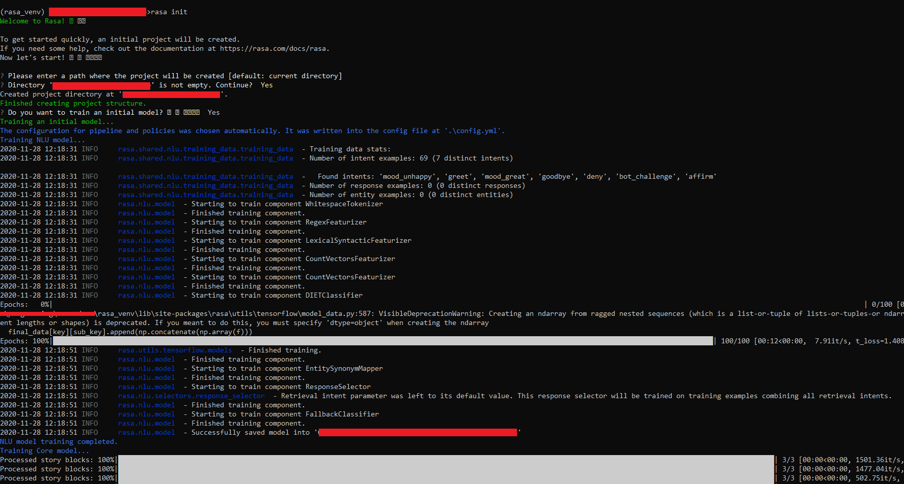
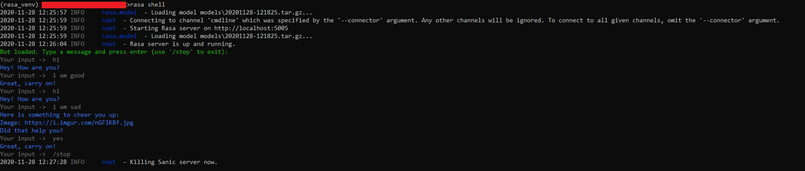
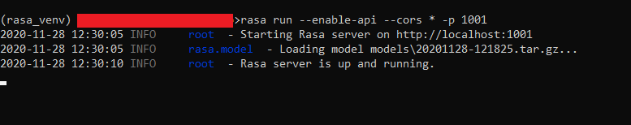
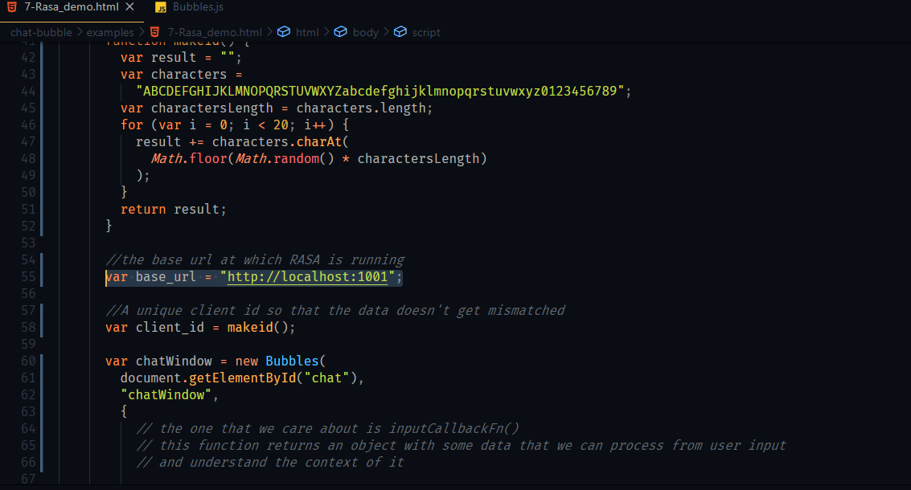
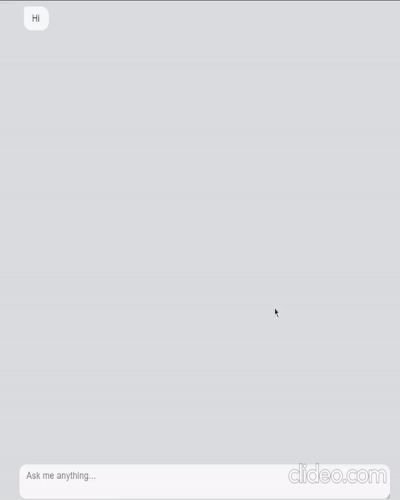

# RASA

[Rasa](https://rasa.com/docs/rasa/) is an open source machine learning framework for automated text and voice-based conversations. Understand messages, hold conversations, and connect to messaging channels and APIs.

## Installation

RASA can be installed using pip (python 3.6,3.7 and 3.8) as follows:
`pip install rasa`
A python [venv](https://docs.python.org/3/library/venv.html) is highly recommended for installing this framework as it depends on specific versions of a heap load of libraries.
You can find RASA's docs on installation [here](https://rasa.com/docs/rasa/installation).

## Getting Started

Let's start with a basic RASA project.

In an empty folder, create a python venv and install RASA in the venv.

Next, execute the following command to create a basic RASA project template:
`rasa init`
RASA will ask you if it should train an initial model, please select "Y".

You can play around with RASA in the command line using `rasa shell`.

You shall now have all the necessary files in the folder in order to get it to work with chat-bubble!

## How to run a RASA server

1. Once you've trained an initial model, execute the following command:
   `rasa run --enable-api --cors '*' -p 1001`
   This will start a new RASA server at `localhost:1001` . `--enable-api` and `--cors '*'` are required to let users make requests from outside the RASA ecosystem. `--cors '*'` gives access to everyone, however it can be changed in the future to control who can access the server. '-p' specifies the port. For more on Rasa run, visit this [link](https://rasa.com/docs/rasa/command-line-interface#rasa-run).

   

2) If you changed the port RASA runs on, update the _base_url_ in the chat-bubble's RASA demo boilerplate code to reflect those changes.

You're ready to make requests to the server via chat-bubble!
Just open Rasa_demo.html in any browser and chat-bubble will take care of rest of the connection!

P.S RASA is a GREAT framework that offers so much more functionality than what is described in this brief tutorial. Please go through the [docs](https://rasa.com/docs/rasa/) to make the most out of it.
